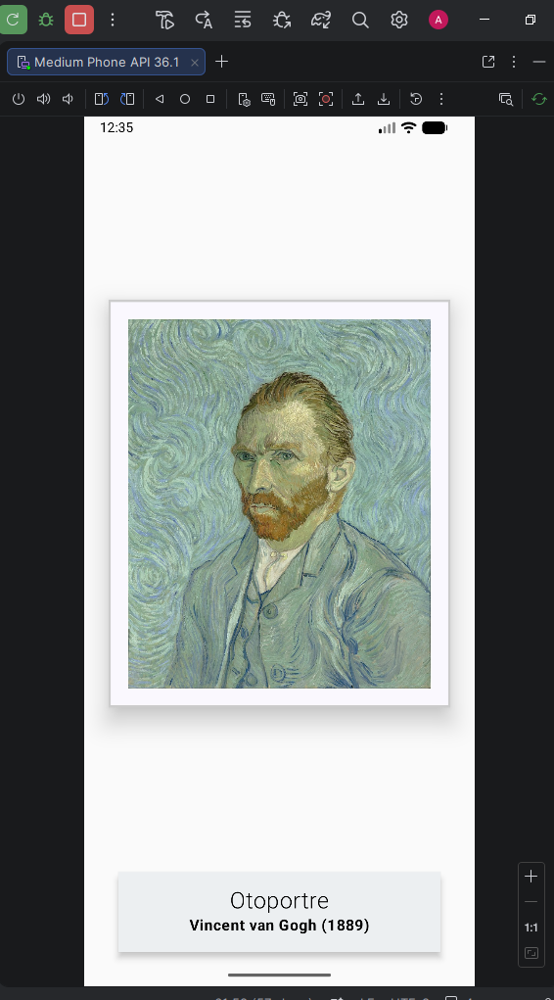
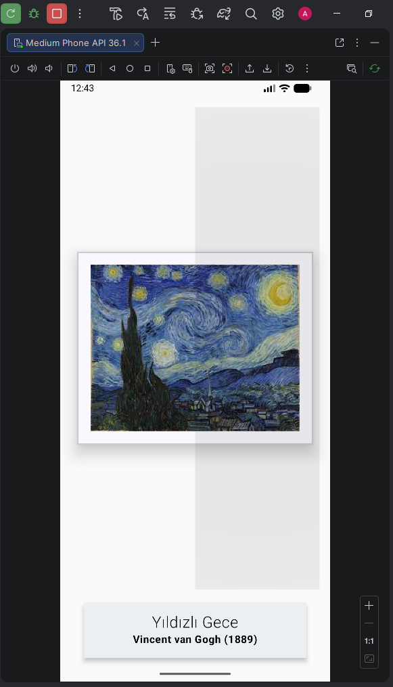

# Etkileşimli Sanat Galerisi

Bu proje, **Jetpack Compose** kullanılarak geliştirilmiş, kullanıcı etkileşimine dayalı dinamik bir dijital sanat galerisi uygulamasıdır. Kullanıcıların sanat eserleri arasında sezgisel bir şekilde gezinebileceği modern bir kullanıcı arayüzü sunar.

## Özellikler

- **Dinamik İçerik Yönetimi:** Kotlin `Data Class` yapısı kullanılarak sanat eseri bilgileri (başlık, sanatçı, yıl) ve görselleri merkezi bir listede yönetilir.
- **Modern Etkileşim:** Geleneksel butonlar yerine, resmin sağ ve sol alanlarına duyarlı **şeffaf dokunmatik katmanlar** ile ileri/geri navigasyonu sağlanır.
- **State Management (Durum Yönetimi):** `remember` ve `mutableStateOf` kullanılarak, uygulama durumu (current index) değiştikçe arayüzün (Recomposition) otomatik güncellenmesi sağlanır.
- **Material 3 Tasarımı:** `Surface`, `ShadowElevation` ve `BorderStroke` gibi bileşenlerle derinlikli ve estetik bir "galeri duvarı" görünümü oluşturulmuştur.
- **Sonsuz Döngü Navigasyonu:** Listenin sonuna gelindiğinde otomatik olarak başa dönen akıllı geçiş mantığı.

## Proje Yapısı ve Layout Hiyerarşisi

Uygulama arayüzü üç ana mantıksal bölüme ayrılmıştır:

1.  **Sanat Eseri Duvarı (Artwork Wall):** Görselin çerçeve ve gölge ile sergilendiği ana bölüm.
2.  **Etkileşim Katmanı (Controller):** `Box` ve `Row` yapısı kullanılarak görselin üzerine binen görünmez navigasyon alanları.
3.  **Tanımlayıcı Bölüm (Descriptor):** Sanat eseri bilgilerinin bulunduğu, görsel hiyerarşiye sahip metin blokları.

## Ekran Görüntüleri

| Ana Ekran | Geçiş Etkileşimi |
| :--- | :--- |
|  |  |

## Yazar

**Ali Osman LAÇİNKAYA** Ankara Üniversitesi -BÖTE Öğrencisi
